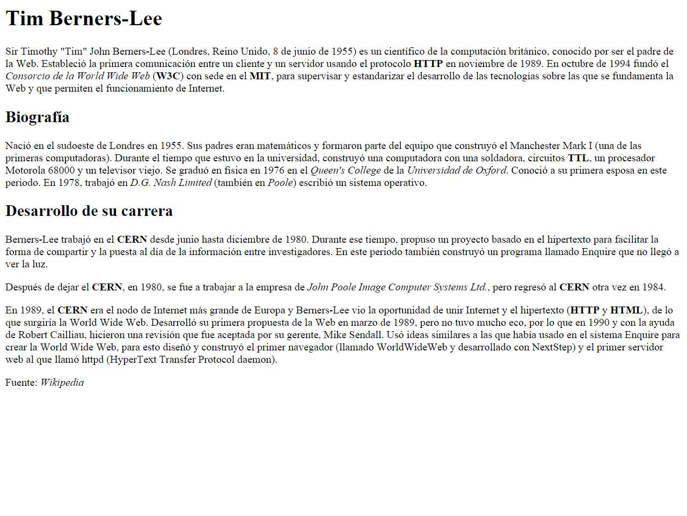

# Enunciado

### A partir del texto que se te proporciona, debes crear una página web que tenga el mismo aspecto que la siguiente imagen:

### Además, tienes que tener en cuenta los siguientes requisitos:

+ El título de la página debe ser Tim Berners-Lee.
+ El texto "Tim Berners-Lee" como encabezado de nivel 1.
+ El texto "Biografía" como encabezado de nivel 2.
+ Todas las siglas, como HTTP, W3C o MIT deben aparecer como texto destacado.
+ Los nombres de las instituciones o empresas, como Consorcio de la World Wide Web o Universidad de Oxford, deben aparecer como texto enfatizado.

> Haz click sobre la imagen de abajo para entrar al código base del ejercicio

# Código base:

