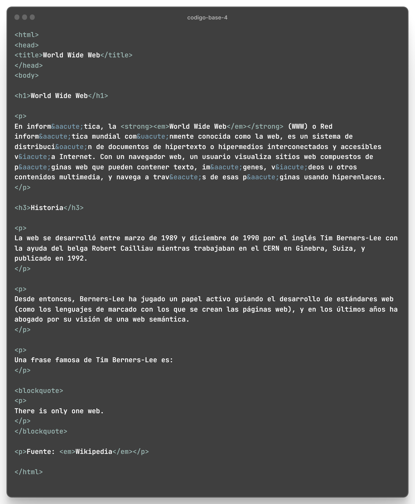

# Enunciado

### Corrige los errores que presenta el código base que se te proporciona. También pueden existir ciertas cosas que no están mal, pero que se pueden hacer mejor.

> Haz click en la imagen de abajo para conseguir el código base de ejercicio.

## Código base:

