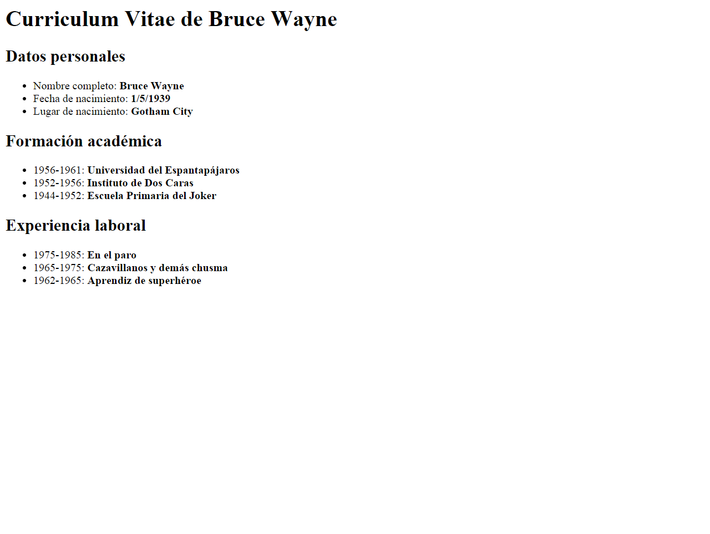
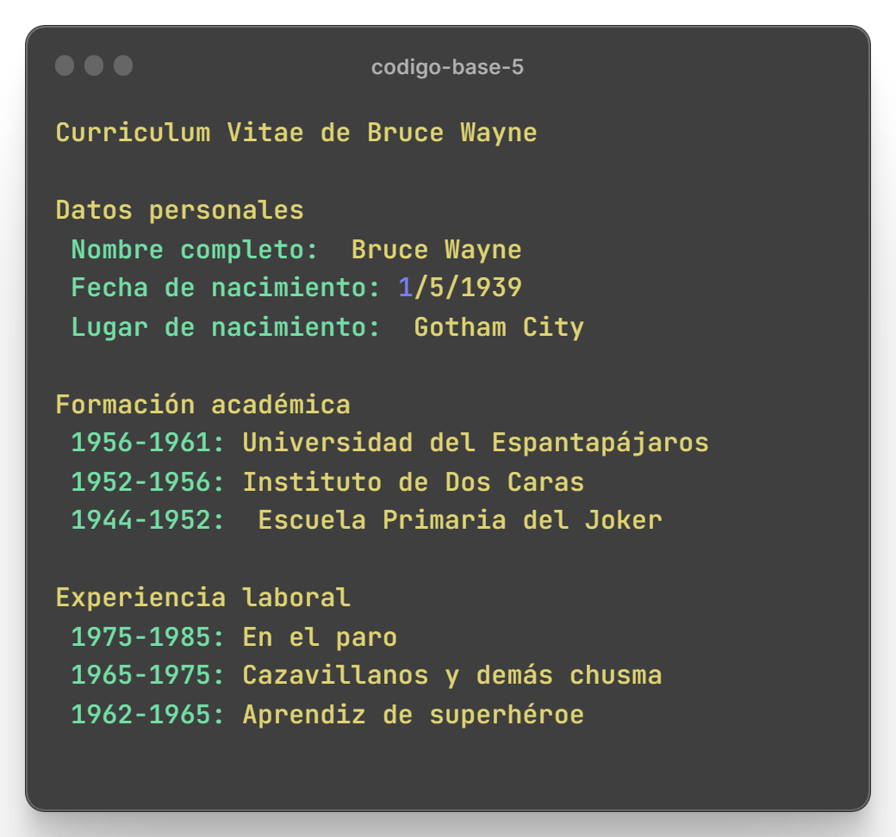

# Enunciado
### A partir del texto que se te proporciona, debes crear una página web que tenga el mismo aspecto que la siguiente imagen:

> Haz click en la imagen para conseguir el código base de ejercicio.

## Además, tienes que tener en cuenta los siguientes requisitos:

> El título de la página debe ser Curriculum Vitae de Bruce Wayne.
> El resto de la estructura de la página debes deducirlo a partir de la imagen proporcionada.

# Código base:

