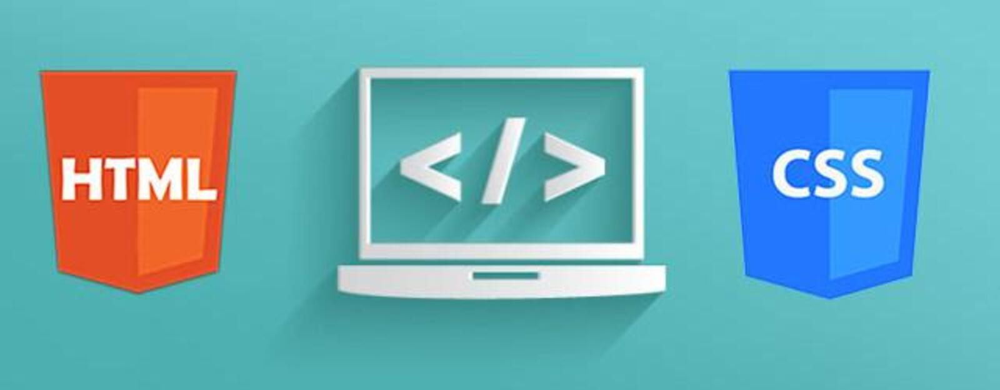

# HTML & CSS: Curso práctico avanzado

> Estos ejercicios están sacados de la web:

> http://desarrolloweb.dlsi.ua.es/libros/html-css/ejercicios

> por Sergio Luján Mora, Catedrático de Universidad

## Ejercicios:

## HTML

+ [Conceptos básicos 1](./HTML/Conceptos%20basicos%201/)
+ [Conceptos básicos 2](./HTML/Conceptos%20basicos%202/)
+ [Conceptos básicos 3](./HTML/Conceptos%20basicos%203/)
+ [Conceptos básicos 4](./HTML/Conceptos%20basicos%204/)
+ [Conceptos básicos 5](./HTML/Conceptos%20basicos%205/)
+ Enlaces
+ Listas 1
+ Listas 2
+ Formularios 1
+ Formularios 2
+ Tablas 1
+ Tablas 2
+ Formularios (HTML5)

## CSS

+ Cómo se usa 1
+ Cómo se usa 2
+ Cómo se usa 3
+ Selectores 1
+ Selectores 2
+ Selectores 3
+ Estilo lista 1
+ Estilo lista 2
+ Modelo caja 1
+ Modelo caja 2
+ Maquetacion diseño fijo
+ Maquetacion diseño elástico
+ Maquetacion diseño líquido
+ Maquetacion formulario 1
+ Maquetacion formulario 2
+ Selectores avanzados 1
+ Selectores avanzados 2
+ Estilo texto 1
+ Estilo texto 2
+ Estilo texto 3
+ Maquetación diseño adaptable 1
+ Maquetación diseño adaptable 2

## Examen HTML-CSS

### Examen 1

